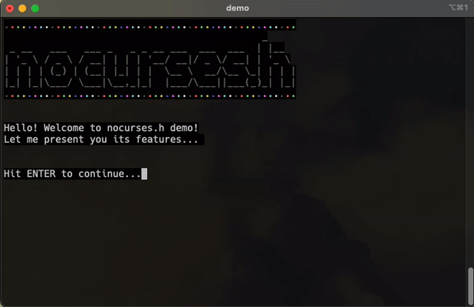

# nocurses.h

This library provides terminal manipulation capability by the use of VT100 ESC sequences. 

It is aimed to simple applications where ncurses is simple "too much".

Inspired by the old Borland conio.h for DOS.

Here's a demo (demo.c file avaiable in the same repo):

## Functions Provided
| Function                 |                                       Description                                      |        Example           |
|--------------------------|:--------------------------------------------------------------------------------------:|:------------------------:|
| wait()                   |                           Waits for the user to hit [ENTER].                           | wait();                  |
| clrscr()                 |                                   Clears the screen.                                   | clrscr();                |
| gotoxy(x, y)             | Sets the cursor do the position x, y. Where x is the row number and y the line number. | gotoxy(10,25);           |
| setfontcolor(color_name) | Sets the text color to one of the colors described on the color table below.           | setfontcolor(RED);       |
| setbgrcolor(color_name)  | Sets the background color to one of the colors described on the color table below.     | setbgrcolor(BLUE);       |
| setfontbold(status)      | Sets the bold attribute on or off. status can be TRUE or FALSE.                        | setfontbold(TRUE);       |
| setunderline(status)     | Sets the underline attribute on or off. status can be TRUE or FALSE.                   | setunderline(FALSE);     |
| setblink(status)         | Sets the blink attribute on or off. status can be TRUE or FALSE.                       | setblink(TRUE);          |
| settitle(title)          | Sets the title of the terminal.                                                        | settitle("Hello World"); |
| setcurshape(shape_name)  | Sets the shape of the cursor in the terminal in the shape table below.                 | setcurshape(BAR);        |
| gettermsize()            | Gets the columns and rows of the terminal.                                             | gettermsize();           |
| getch()                  | Gets a character without waiting for enter.                                            | getch();                 |
| getche()                 | Gets a character and echoes it without waiting for enter.                              | getche();                |
| clrline()                | Clears the row contents.                                                               | clrline();               |
| resetcolors()            | Reset terminal to default colors.                                                      | clrline();               |

## color_name

Valid color names are:

| color_name |
|:----------:|
| BLACK      |
| RED        |
| GREEN      |
| YELLOW     |
| BLUE       |
| MAGENTA    |
| CYAN       |
| WHITE      |

## shape_name

Valid shape names are:

| shape_name      |
|:---------------:|
| BLOCK_BLINK     |
| BLOCK           |
| UNDERLINE_BLINK |
| UNDERLINE       |
| BAR_BLINK       |
| BAR             |

